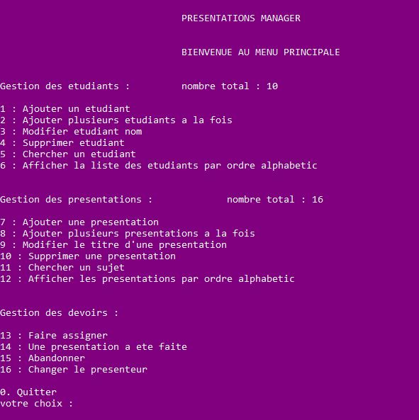

# gestion_des_presentations

C'est un console application qui va aider les profs à la gestion des présentations des étudiants, avec plein de fonctionnalités, comme la liste suivante montre:

Ce programme utilise les bases de la language C (rien d'extraordinaire) car c'est mon projet du module "Programmation en language C" de la troisième semestre à l'École Nationale des Sciences Appliquées de Khouribga (ENSAKH), année universitaire 2019/2020.
c'était une expérience très agréable qui m'a aidé à solidifier les concepts de la programmation :)

Encadré par monsieur Mostafa Saadi.
